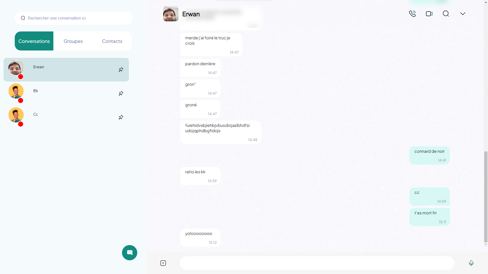

# WhatsappClone Using ReactJs

# Aperçu du jour :



# How to install project

```bash
git clone https://github.com/Matsuel/Whastapp-Clone.git
cd Whatsapp-Clone
npm i
npm start 
```

And now go on http://localhost:3000/ for test app

# Features availables

<ol>
    <li>Send messages</li>
    <li>Create conversation</li>
    <li>Show status</li>
    <li>Search conv</li>
    <li>Join files but not send for the moment</li>
    <li>Delete/react message</li>
    <li>React message</li>
    <li>Double click on message add like</li>
    <li>Long click open context menu</li>
</ol>

---

# Finals features

<ol>
    <li>Call video and voice</li>
    <li>Send files without broken them</li>
    <li>Search messages to conv</li>
    <li>Edit message</li>
</ol>

# Clique droit sur une conversation 
*Changer le nom mais pour plus tard*

# Clique dans une conversation

*Changer de thème donc faut les mettre en place*

# Pour les fichiers

*Les sauvagrder directement sur le serveur en data url (fait et fonctionne correctement) juste le sauvegrader avec un timestamp à la fin du nom de fichier si jamais 2 fichiers ont le meme nom cpt*
*save le fileName+timestampt dans la db*
*Quand on récup les messages on renvoit data url et c'est censé fonctionner correctement*

---

<ol>
<li></li>
<li>Ajouter menu à droite pour la Recherche de messages dans la conversation</li>
<li>Patch problème envoie de fichiers qui sont modifiés et inutilisables après réception</li>
<li>Custom clique droit message dans message area pour pouvoir changer de thème donc créer un ensemble de thèmes</li>
<li>Edition du profil</li>
<li>Appel</li>
<li>Faire du chiffrement de bout en bout avec des clés publiques et privées différentes pour chaque conversation</li>
<li>Permettre les groupes</li>
<li>Permettre de mettre des noms custom aux personnes, et des réactions</li>
</ol>